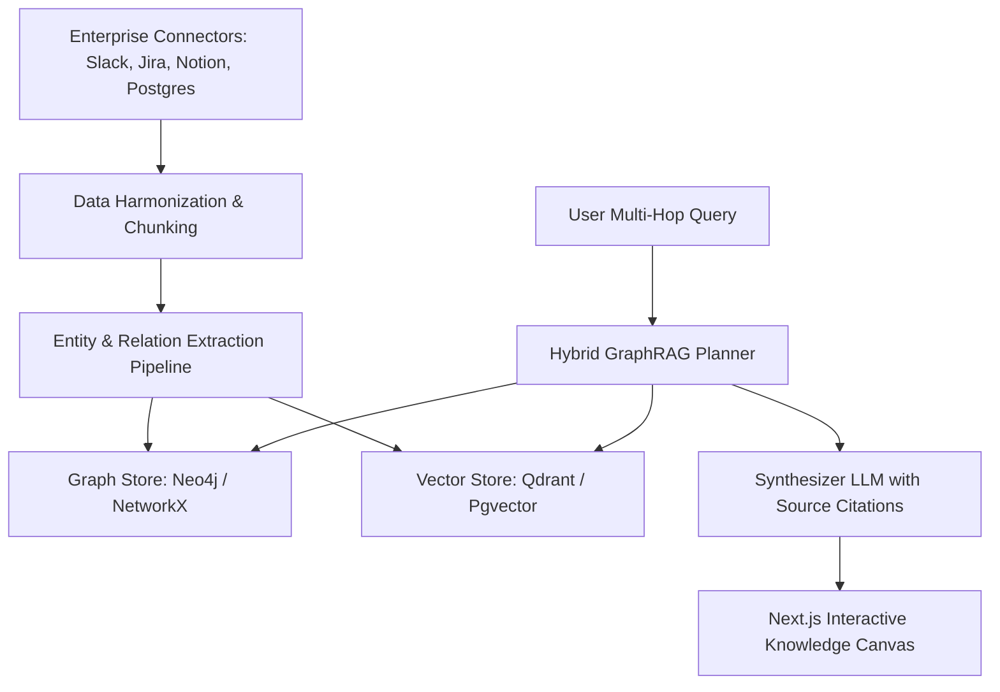

# Technical Specification: NexusGraph
**Project Name:** NexusGraph (Galuxium Nexus V2)  
**Status:** Prototype implemented — spec is target design (updated 2026-09-18)  

> **Implementation status (2026-09-18):** The sections below describe the *target* architecture. Built: a real hybrid vector + breadth-first graph-traversal retriever (WRRF scoring) over an in-memory knowledge graph (328 LOC, 5 passing tests). Not yet built: real enterprise connectors (Slack/Jira/Notion), LLM entity extraction, persistent Neo4j/pgvector stores, and the Next.js/Three.js graph canvas (currently static HTML). Ingestion is mocked.
**Version:** 1.0.0  

---

## 1. System Architecture
NexusGraph combines a property graph model (nodes & edges) with dense vector embeddings (hybrid search: BM25 + Vector + Graph Traversal) to execute multi-hop reasoning over enterprise knowledge bases without hallucinations.



---

## 2. Functional Requirements

### 2.1 Multi-Source Enterprise Connectors
- Ingest unstructured text (documents, chat threads, tickets) and structured tables.
- Incremental sync engine respecting ACLs (Access Control Lists) and tenant isolation.

### 2.2 Semantic Graph Extraction
- Extract named entities (People, Projects, Services, APIs, Incidents) and relations (`DEPENDS_ON`, `OWNED_BY`, `DOCUMENTED_IN`, `TRIGGERED_BY`).
- Continuous entity resolution to merge duplicates across disparate platforms.

### 2.3 Multi-Hop Query Engine
- Transform natural language queries into Cypher / Graph Traversal queries combined with vector similarity.
- Produce verified answers where every factual assertion references a clickable graph node ID and source document offset.

---

## 3. Data Schema

### 3.1 Entity Node Definition
```typescript
interface EntityNode {
  id: string;
  name: string;
  type: 'PERSON' | 'PROJECT' | 'SERVICE' | 'DOCUMENT' | 'INCIDENT';
  attributes: Record<string, any>;
  embedding: number[];
  sourceOrigin: {
    system: string;
    externalId: string;
    url: string;
  };
}
```

### 3.2 Relation Edge Definition
```typescript
interface RelationEdge {
  id: string;
  sourceId: string;
  targetId: string;
  relationship: string;
  weight: number;
  extractedFromDocId: string;
}
```

---

## 4. Acceptance Criteria
1. Successfully ingest 100+ sample cross-domain enterprise documents and generate connected entity graph.
2. Answer 3-hop questions accurately (e.g., *"Which service deployment caused the checkout outage, and who is the current code owner?"*).
3. Provide interactive 3D/2D force-directed graph view with search and path highlights in under 1 second.
